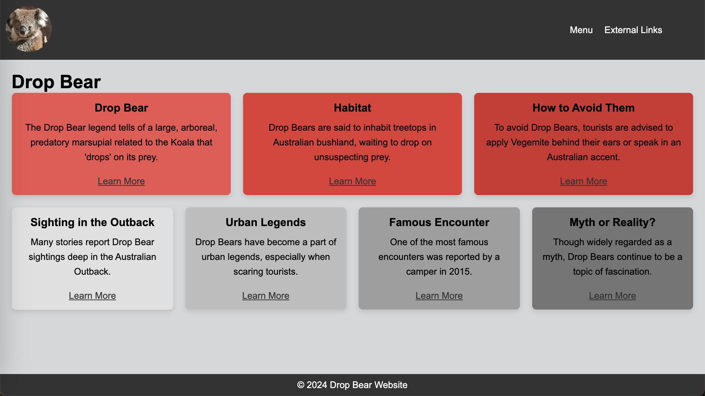
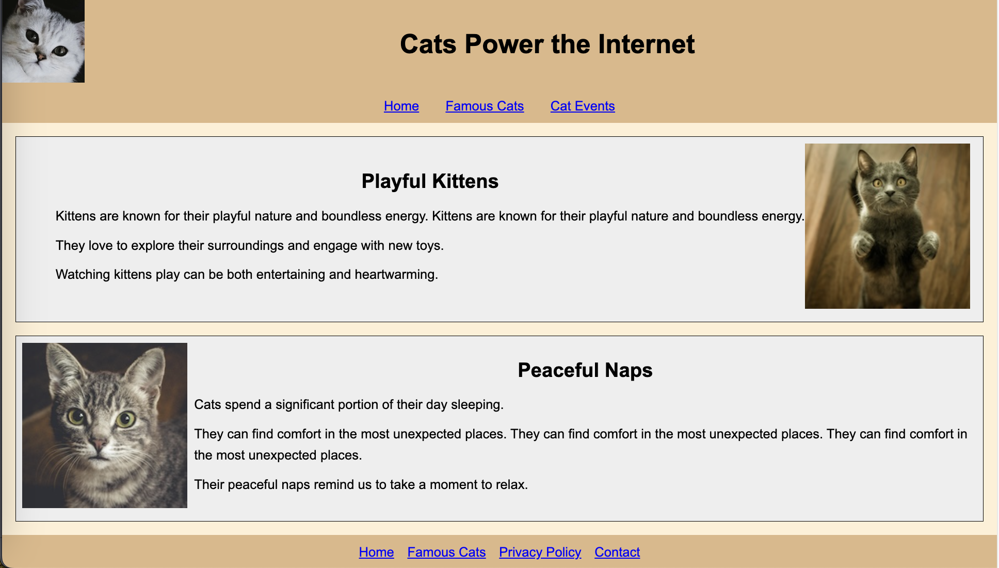

# Frontend Web Development Projects

Welcome to the **Frontend Web Development Projects** repository! This repository contains a collection of projects and assignments I completed as part of my **INFO 6150 - Web UI/UX Engineering** course at Northeastern University. These projects and assignments demonstrate my understanding and implementation of frontend web development concepts, including HTML, CSS, JavaScript, and React.

## Table of Contents

- [Overview](#overview)
- [Projects](#projects)
  - [Project 1: HTML and CSS](#project-1-html-and-css)
  - [Project 2: JavaScript](#project-2-javascript)
  - [Final Project: React](#final-project-react)
- [Assignments](#assignments)
- [Key Learnings](#key-learnings)
- [Technologies Used](#technologies-used)
- [How to Run](#how-to-run)
- [Screenshots](#screenshots)
- [Future Improvements](#future-improvements)

---

## Overview

This repository showcases my journey in learning frontend web development fundamentals. Through various projects and assignments, I developed skills in:

- Semantic HTML and modern CSS techniques.
- Creating interactive and responsive user interfaces.
- Writing and debugging JavaScript to add dynamic functionality.
- Building Single Page Applications (SPA) using React.

Each project in this repository highlights a specific area of web development, progressing from static web pages to dynamic, React-powered applications.

---

## Projects

### Project 1: HTML and CSS

**Demo Links**: [Project1](https://jingchenyc.github.io/frontend-web-development-projects/project1/public/)

**Description**: This project focused on building a responsive and accessible static website using HTML and CSS. The website includes semantic HTML elements, CSS Flexbox, and Grid layouts.

- **Key Features**:
  - Responsive design for mobile and desktop screens.
  - Styled using modern CSS techniques, including Flexbox and Grid.
  - Accessibility considerations (e.g., semantic tags, proper labeling).

**Folder**: [`/project1`](./project1)

---

### Project 2: JavaScript

**Demo Links**: [Project2](https://jingchenyc.github.io/frontend-web-development-projects/project2/public/)

**Description**: This project added interactivity to web pages using JavaScript. Key functionalities include form validation, interactive UI components, and user input handling.

- **Key Features**:
  - JavaScript form validation.
  - Interactive components like modals and accordions.
  - Dynamic DOM manipulation.

**Folder**: [`/project2`](./project2)

---

### Final Project: React

**Demo Links**: [Final (React + Vite)](https://jingchenyc.github.io/frontend-web-development-projects/final/tutor-website/public/)

**Description**: The final project showcases a React-based Single Page Application (SPA) that demonstrates my understanding of React components, state, props, and hooks.

- **Key Features**:
  - Built using React with Vite for a modern development setup.
  - Dynamic UI components with React state management.
  - Responsive and mobile-friendly design.

**Folder**: [`/final`](./final)

---

## Assignments

The **work** folder contains various assignments completed throughout the course. These assignments helped reinforce the concepts learned during lectures and were instrumental in building foundational frontend development skills.

- **Key Concepts Covered**:
  - React components and props.
  - DOM manipulation and JavaScript logic.
  - Practical application of HTML and CSS for small tasks.

**Folder**: [`/work`](./work)

---

## Key Learnings

Through these projects and assignments, I learned:

- The importance of semantic HTML for accessibility and SEO.
- Advanced CSS techniques for building responsive designs.
- Writing modular, reusable JavaScript for web interactions.
- Using React to build scalable, dynamic web applications.

---

## Technologies Used

- **HTML5**: Semantic structure for web pages.
- **CSS3**: Styling using Flexbox, Grid, and animations.
- **JavaScript (ES6+)**: DOM manipulation and interactivity.
- **React**: Component-based development.
- **Vite**: Modern frontend tooling for React projects.

---

## How to Run

1. **Clone the repository**:

   ```bash
   git clone https://github.com/jingchenyc/frontend-web-development-projects.git
   cd frontend-web-development-projects
   ```

2. **Navigate to a project or assignment folder**:

   ```bash
   cd project1  # Replace with 'project2', 'final', or 'work' for other folders
   ```

3. **Open in a browser**:
   - For HTML/CSS/JS projects: Open `index.html` in your browser.
   - For React projects:
     - Install dependencies: `npm install`.
     - work:
       - Start the development server: `npm run dev`.
     - project1 and project2:
       - Start the development server: `node server.js`.
     - final project:
       - `npm run build`
       - `npx serve -s dist`

---

## Screenshots

### Project 1: HTML and CSS



### Project 2: JavaScript



### Final Project: React


---

## Future Improvements

- **Project 1**:

  - Add advanced CSS animations.
  - Incorporate dark mode toggle.

- **Project 2**:

  - Include API integration for dynamic content.
  - Add local storage for persisting user data.

- **Final Project**:
  - Enhance state management using Redux.
  - Deploy the project using GitHub Pages or Vercel.

---

## Author

**Jing Chen**  
GitHub: [jingchenyc](https://github.com/jingchenyc)

Feel free to explore or provide feedback!
